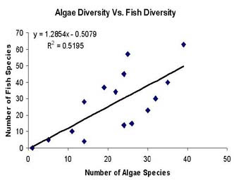
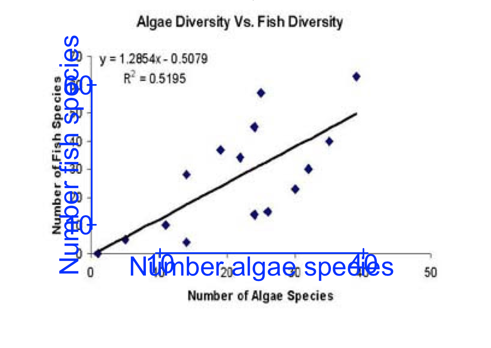
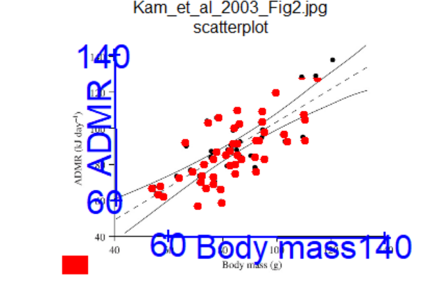
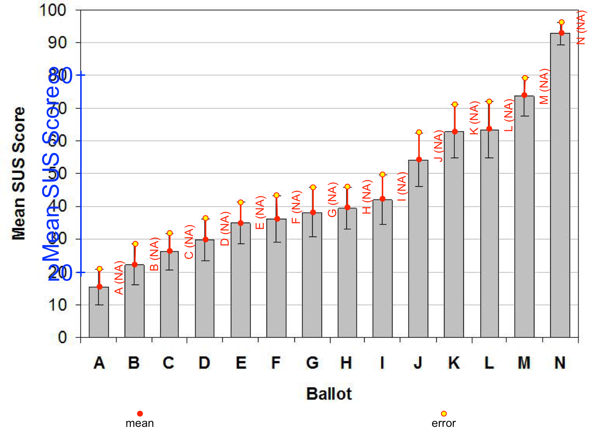

```{r setup, include=FALSE}
knitr::opts_chunk$set(echo = TRUE)
```

# Introduction
We have covered some basic graphics in meta-analysis using the `metafor` package, including the use of "forest plots" to quickly show the results of a meta-analysis and "funnel plots" to detect publication bias. You have also covered PRISMA diagrams in the earlier part of this course. One challenge you will encounter is that often papers will publish graphs, but not the data used to create those graphs. In the past you had to use tracing paper and pencil to manually get the data, but now there are automated methods which (sometimes) make life easier. There are several R packages that do this, and we will focus on the `metaDigitise` package, which is relatively new and rapidly evolving. It can extract data from scatter plots and bar charts. It is very **interactive** in its usage, so you will have to play with it to understand its operation, as it is tricky to explain on a website or practical handout.

## Installing metaDigitise package
You may have done this already, but if not, begin by installing the package from the default CRAN website.

```{r installing metagear, eval=FALSE}
# Install metaDigitise as usual
install.packages("metaDigitise")
```

Once you have installed the packages, you can load them up, along with the metafor and tidyverse packages, with the `library` command as usual. 

```{r load metagear, warning=FALSE, message=FALSE}
library(metafor)
library(metaDigitise)
```

The overall aims of the practical are to get you comfortable with using `metaDigitise` to scrape data from published figures. You can use the Windows "snipping tool" to capture figures from screen, and some online journals allow you to download figures directly. `metaDigitise` can cope with .png, .jpeg, .tiff and .pdf formats. Specific objectives are to learn how to scrape data from:

1. simple but blurred scatterplots and compare with expected data
2. scatterplots containing large numbers of points representing different groups
3. barplots with 95% confidence intervals


**Before you begin**
The `metaDigitise` package can bulk process images if you have stored them in sub-folders to represent different papers. See [the metaDigitise site](https://cran.r-project.org/web/packages/metaDigitise/vignettes/metaDigitise.html) for examples. We are going to use a simpler approach, as we only have 4 graphs to work with. Download the files `Kam_et_al_2003_Fig2.jpeg`, `example_2_scatterPlot.jpg` and `Kortum_and_Acymyan_2013_Fig4.jpg` from Canvas and save them into a folder (directory) called **`Figures`** within your RStudio project folder.

# 1. Scraping data from scatterplots
Sometimes a paper will contain a graph that has the raw data, but not in numerical form, and you need to be able to calculate for example the correlation coefficient, or the means and standard deviations. Download and save your graphs into your `Figures` folder, run the following code: (**Note** this practical assumes you are using an R project, so your working directory is automatically correct. If you are not using a project, set your working folder manually via the  "Session" -> "Set working directory..." menu).

The `metaDigitise` package allows you to digitise multiple graphs stored in a folder, saving results in a `caldat` folder, but you can stop and resume graphs whenever you want.

```{r load_and_display, eval=FALSE}
# metaDigitise works by looking at a folder (known as directory or dir) and accessing all the images within that folder
# the package can access multiple image formats (`.png`, `.jpg`, `.tiff`, `.pdf`) and different types of figures
figure_data <- metaDigitise(dir = "Figures")
```

The first thing that will happen is you will be given a selection of options 1:3 as below in the Console window:

```{r menu1, eval=FALSE}
Do you want to...

1: Process new images
2: Import existing data
3: Edit existing data
```

Type `1` into the console and press enter to choose the option to process new images. Next you will be asked whether all the plot types within the directory are the same type, enter `d` to indicate they are different types. The first figure is displayed in the plot window:



You'll notice that as well as the data points there is also a regression line and some text, and a title, which we want to ignore if we are actually after the raw data. In reality, since the $R^2$ value is available in this figure, and you know the number of points, you wouldn't really need to digitise this one. However, it will be nice to compare how closely your estimated $R^$ matches the real one in the figure! The image is also a little blurred, so it will be a good test of the software.

In the Console, you will see the following text displayed:

```{r menu2, eval=FALSE}
**** NEW PLOT ****


mean_error and boxplots should be vertically orientated
       _ 
       |	
  I.E. o    NOT  |-o-|
       |
       _

If they are not then chose flip to correct this.

If figures are wonky, chose rotate.

Otherwise chose continue

Flip, rotate or continue (f/r/c)
```

The figure is correctly oriented, therefore choose option  `c` for continue. Note that the response is case-sensitive, so ensure you are entering the letters in lower case. Next you get a menu that states:

```{r menu3, eval=FALSE}
Please specify the plot_type as either:

 m: Mean and error
 b: Box plot
 s: Scatter plot 
 h: Histogram

```

As you can see we have a scatter plot, so select `s` for the next option. You will see the statement:

`What is the y variable?`

and enter `Number fish species` as your answer. For the equivalent question about the horizontal axis, enter `Number algae species`. In the Console you will then see the following displayed:

```{r, eval=FALSE}
On the Figure, click IN ORDER: 
      y1, y2 , x1, x2  


    Step 1 ----> Click on known value on y axis - y1
  |
  |
  |
  |
  y1
  |_________________________


    Step 2 ----> Click on another known value on y axis - y2
  |
  y2
  |
  |
  |
  |_________________________
  
 
    Step 3 ----> Click on known value on x axis - x1
  |
  |
  |
  |
  |
  |_____x1__________________


    Step 4 ----> Click on another known value on x axis - x2
  |
  |
  |
  |
  |
  |___________________x2____

```


Follow the instructions to first click on and then enter values for two points on the y and then x axes. Try and be as accurate as possible, and it is often useful to pick values near the end of each axis e.g. (10, 60) and (10, 40) or (0, 70) and (0, 50) respectively. After clicking each pair of points, your graph will be highlighted in blue along the axis. After all four clicks, enter the relevant numbers in the Console. The numbers, and your own axis labels, will be super-imposed onto the plot. The next menu question is:

```{r, eval=FALSE}
Are any axes on a log scale? Enter n if none or combination of log axes (x/y/xy)
```

Neither axis is on the log scale so answer `n`. In case you made any mistakes you are given the option to re-calibrate your points:

```{r, eval=FALSE}
Re-calibrate? (y/n)
```

so assuming no errors type `n`. 

Finally, you will be asked to enter group identifiers if needed, in this case we don't but if the data points in the plot belonged to two or more different groups, for instance different habitat types with two different symbols or colours for the points, then we could label this here. In our case, simple press the enter key.



The following message will be displayed in the RStudio Console:

```{r, eval=FALSE}
Group identifier:  


Click on points you want to add.
If you want to remove a point, or are finished with a group, 
exit by clicking on red box in bottom left corner, then follow prompts

```

Now carefully click on each of the points in your graph. There are 15 points to click, with two quite difficult to see as they are close to the fitted line at the bottom left of the graph. Ignore the regression line but click on the two points that over-lie onto the regression line. You can resize your plot panel so that it takes up most of the screen and you can see all the points clearly. Try to center the cross hairs on the middle of the data point.


You can click the points in any order, and they will be marked red once you have done so. If you make a mistake, don't worry - you will be asked if you want to redo any of the stages at the end of the process. Once you have selected each point, click in the red square in the bottom left corner of the image or select finish in the top right. The following message will be displayed:

```{r, eval=FALSE}
Add or Delete points to this group, or Continue? (a/d/c) 
```

Assuming you haven't made any major digitising errors, enter `c` to continue. If you've made a mistake use `a` or `d` to correct them. The next message would be relevant if you had multiple groups (e.g. scatterpoints with different symbols) but does not apply here, therefore enter `f` to finish the plot.

```{r, eval=FALSE}
Add group, Edit group, Delete group, or Finish plot? (a/e/d/f)
```

The next message relates to the number of sample points available. For me it is displaying:

```{r, eval=FALSE}
The estimated samples sizes for each group are:


   
15 

The known sample size may differ from that in the extracted data
 (e.g. if there are overlaying points)

Do you want to enter a different sample size from that estimated? (y/n)
```

Depending on the complexity of the graph you are working with, it might not be easy to see all the points. If this number is known (e.g. from the Methods of the paper) you can enter it here, and `metaDigitise` will adjust the estimated errors in your data accordingly. Fortunately I've managed to digitise all the points, so I am entering `n` to this menu.

We have now finished digitising the first graph, and `metaDigitise` has detected that there are two more to complete. It responds with the message:

```{r, eval=FALSE}
Do you want continue: 2 plots out of 3 plots remaining (y/n)
```

You could automatically continue onto the next graph by entering `y`, but let's assume you want a well-earned coffee break. Select `n` and we can look at the results so far. We saved the data in `figure_data` so display it in the Console window:

```{r, eval=FALSE}
figure_data
```

There are two rows of output, representing the x- and y-axes of your graph. If you had two groups of points, you would have 4 rows etc. The mean, sd, se for each axis is given. As we only have one group (which we didn't both naming) the group_id column is empty. The correlation coefficient `r` is given; this is of course identical for both rows (one group), and for me it is 0.7199; you will have a slightly different value. Recall that the R-squared value was printed on the graph at `0.5195`; how close is our value: $0.7199^2$ = `0.7199^2` = `0.5183` Pretty good!

Strictly-speaking, we did not really need to digitise thise graph, as the fitted line and R-squared were already available, but this demonstrates that you can obtain surprisingly accurate results using the software.


# 2. Scatterplot with lots of points
Again we have a scatter plot with a fitted regression line, but we do not actually know the values for the regression; you might want to know the correlation coefficient for example, to undertake the type of analysis done in `metafor` in your earlier practical. This image is far less pixelated, we can see the points more clearly, though where there are points overlapping or close together will be more difficult to extract from. Follow the same steps to extract the data from this scatterplot, **note that the original paper had a sample size of 51**, so you can enter this value when prompted if you have not manage to locate all the points.

You can continue where you left off, by entering

```{r, eval=FALSE}
figure_data <- metaDigitise(dir = "Figures")
```

Don't worry, you won't lose your original data, which is actually saved in a subfolder of your `Figures` folder called `caldat`. Select `1` to process new images, and indicate that the plot types are different with `d`. The next plot from Kam et al will be displayed automatically. Digitise it as before, but when it comes to the number of points it is unlikely you will have identified 51. Enter the correct value manually.



My attempt at digitising these data is shown above; I ended up with 49 points digitised, so manually updated the sample size when prompted to 51. When you receive the following prompt:

```{r, eval=FALSE}
Do you want continue: 1 plots out of 2 plots remaining (y/n)
```

Enter `n` so that you can look at your `figure_data` table. You can see that two more rows have been added, for the new figure, with the relevant means, sds etc. The value for the number of samples, under column `n`, is showing as 51 not the slightly incorrect lower number that I digitised. The sd and se have been adjusted to account for this.

<!---
You can now analyse the raw data in any way you wish; if you want to covert it into a "tidy" format (which is more flexible for data handling), use the syntax `raw_data <- as_tibble(raw_data)`.
--->

# 3. Scraping data from bar charts +/- 95% CI
Sometimes barchart are published, with means and error bars, but the raw data are not presented in tables.  Depending on the quality of the original figure, you might be able to extract some or all of the data.
`
Let's now try extracting the means and 95% CI from this final image, a barplot. We will add the results to our existing `figure_data` dataset:

```{r, eval=FALSE}
figure_data <- metaDigitise(dir = "Figures")
```

Select option `1` to `Process new images` and `d` for different plot types. A bar plot will be displayed, and enter `c` to continue as it does not need to be flipped etc. When you see the menu:

```{r, eval=FALSE}
Please specify the plot_type as either:

 m: Mean and error
 b: Box plot
 s: Scatter plot 
 h: Histogram
```

select `m` when asked for the plot type. Follow the data extraction flow - note that this time you are only asked to enter information for the y axis. We're asked to enter sample sizes, in this case we don't know. **Note**: Ideally use publications where you know the sample sizes, as you can do much more useful meta-analyses with them.

In this case we can enter a group identifier as the ballot letter for each of the bar plots - starting with A. Once you reach the data extraction stage, click first on the top of the 95% CI whisker, and then on the top of the bar. Once you've extracted from the first bar, enter `a` to add a group and move onto B from the ballot letters.

The top of the error bar will be shown with a open circle and the mean a closed red circle. Each bar has a red label to the right of the bar, e.g. `A (NA)` for the first bar. The `NA` refers to the fact that we do not know the sample sizes. Once you've finished extracting from the plot, by typicing `f` you will be asked to select the type of error for this plot, enter `CI95`.  



Data extraction is complete, the data we've extracted is now in a dataframe called `figure_data`. Have a look at `figure_data` and notice the extra rows from your barplot.

If you look at you `Figures` directory you will see that there is now a folder called `caldat` which is where `metaDigitise` stores the information about plots you've already digitised, that means you could add new figures to this folder and rerun the `metaDigitise` function without having to redo the images you have already extracted from. You could edit the data you have already extracted, if for instance you had additional imformation (e.g. sample size) or you realised one of the axes was on log scale. If you are in a new RStudio session, simply enter:

```{r, eval=FALSE}
figure_data <- metaDigitise(dir = "Figures")
```

and the following screen will be displayed, but choose option 2.

```{r, eval=FALSE}
Do you want to...

1: Process new images
2: Import existing data
3: Edit existing data

Selection: 2
```

You can import all the data, or just information for one graph. You can also access the raw data, for example the individual x- and y-coordinates from your scatterplot. Simply add the option `summary = FALSE` when you import the data:

```{r, eval=FALSE}
figure_data <- metaDigitise(dir = "Figures", summary=FALSE)
```

Do this for your second graph, `2. Kam_et_al_2003_Fig2`, and have a look at `figure_data`. The first few rows will contain:

```{r, eval=FALSE}
   id         x         y group col pch y_variable x_variable
1      58.07692  62.28571     1 red  19       ADMR  Body mass
2      56.15385  63.42857     1 red  19       ADMR  Body mass
3      56.92308  68.00000     1 red  19       ADMR  Body mass
4      53.84615  66.85714     1 red  19       ADMR  Body mass
```

so you have access to the individual x and y coordinates. We only had one group of data here, but it would give the information in the `group` column if needed for multiple groups.
<!---
Whilst the `raw_data3` output contains the data, it is not easy to interpret, as it contains the mean, lower 95% CI, and upper 95% CI in triplets, as one long vector of numbers.  They are also hard to relate to the 14 codes labelled A to N in the original graph.  So we need to do some minor manipulations on the data:

#```{r reshape barplot data}
statistic <- rep(c("mean", "lower_95CI", "upper_95CI"), 14)
code      <- rep(LETTERS[1:14], each=3)
raw_data3_lng <- tibble(bar_data = raw_data3, statistic=statistic, code=code)
raw_data3_wde <- spread(raw_data3_lng, key=statistic, value=bar_data)
print(raw_data3_wde)
```

You used the `gather` function in the first practical using R, to reshape "wide" data from many multiple columns into a smaller number of columns in a "long" format.  Here you use the opposite `spread` function, to reshape the data in `raw_data3_lng` which has 42 variables in 3 columns, into a more manageable `raw_data3_wde` which has 14 rows and 4 columns.  You will find it useful later on in your MSc to have a good grasp of how to use `gather` and `spread` to reshape messy data.
--->
# Capturing a graph from a paper
You may at this point be wondering how to extract just one graph from a scientific paper.  There are several ways of doing this, but the easiest is simply to display the pdf, zoom into the graph you are interested in, and fire up the `Snipping Tool` that is installed on every Windows 7 and Windows 10 PC.  Then you can highlight a rectangle containing your graph and save it to a graphics file.

Other R packages can be used to scrape data from graphs, including `metagear` and `digitizeR`.  The former allows more automated data extraction, whilst the latter also works for dot distribution maps.
