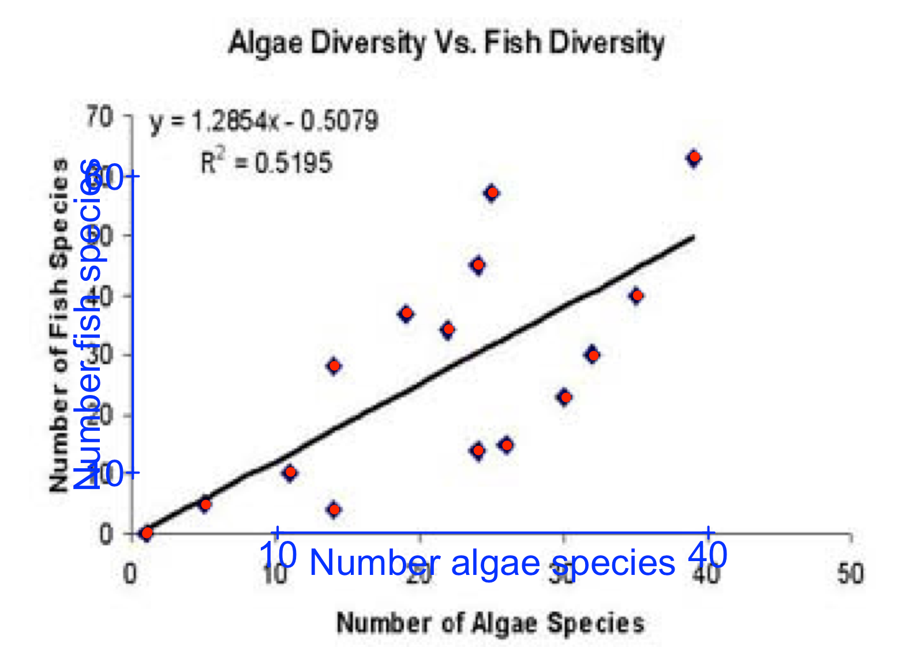

```{r setup, include=FALSE}
knitr::opts_chunk$set(echo = TRUE)
```

# Introduction
We have covered some basic graphics in meta-analysis using the `metafor` package, including PRISMA plots to illustrate the processes in a systematic review, plus the use of "forest plots" to quickly show the results of a meta-analysis.  In this practical, we will use `metaDigitise` to extract numbers out of graphs, particularly scatter plots and bar charts.  This can be useful where a published paper has graphs, but does not provide the summary tables needed to carry out a meta-analysis. 

# Installing metaDigitise package

```{r installing metagear, eval=FALSE}
# Install metaDigitise as usual
install.packages("metaDigitise")

```

Once you have installed the packages, you can load them up, along with the metafor and tidyverse packages, with the `library` command as usual. 

```{r load metagear, warning=FALSE, message=FALSE}
library(tidyverse)
library(metafor)
library(metaDigitise)
library(here)
```

# Scraping data from scatterplots using metaDigitise
Sometimes a paper will contain a graph that has the raw data, but not in numerical form, and you need to be able to calculate for example the correlation coefficient, or the means and standard deviations.

Download the files `Kam_et_al_2003_Fig2.jpeg`, `example_2_scatterPlot.jpg` and `Kortum_and_Acymyan_2013_Fig4.jpg` from Canvas and save them into a folder (directory) called `Figures` within your working directory.

```{r load and display }
# metaDigitise works by looking at a folder (known as directory or dir) and accessing all the images within that folder
# the package can access multiple image formats (`.png`, `.jpg`, `.tiff`, `.pdf`) and different types of figures
#figure_data <- metaDigitise(dir = here("Figures"))
```

The first thing that will happen is you will be given a selection of options 1:3. Type `1` into the console and press enter to choose the option to process new images. Next you will be asked whether all the plot types within the directory are the same type, enter `d` to indicate they are different types and then choose `c` when asked whether the figures are wonky or horizontally oriented. Note that the response is case-sensitive, so ensure you are entering the letters in lower case.  

The first image we are going to work with is a scatter plot, so select `s` for the next option and type in the y and then the x axes labels. Note that the image is a little blurred, and there is also text on the image (actually for the regression line, so in this case you can easily compare what the data you extract calculates). Follow the instructions to first click on and then enter values for two points on the y and x axes. Neither axis is on the log scale so select `n` when asked about this. Finally, you will be asked to enter group identifiers if needed, in this case we don't but if the data points in the plot belonged to two or more different groups, for instance different habitat types, then we could label this here.  


The next stage is to click on each of the data points within the figure, ignoring the regression line. You can resize your plot panel so that it takes up most of the screen and you can see all the points clearly. Try to center the cross hairs on the middle of the data point. You can click the points in any order, and they will be marked red once you have done so. If you make a mistake, don't worry - you will be asked if you want to redo any of the stages at the end of the process. Once you have selected each point, click in the red square in the bottom left corner of the image or select finish in the top right. If you've made any errors or missed any points (note that you should have n = 16 at the bottom of your plot panel) then you can correct this at this stage, otherwise enter `c` and then `f` to finish with this plot when prompted. If we know that the sample size is different to the number of data points we have managed to locate on the plot then we can enter this now, in this case enter `n`. Then continute (enter `y`) to the next plot.  



Again we have a scatter plot with a fitted regression line and error bars, but we do not actually know the values for the regression; you might want to know the correlation coefficient for example, to undertake the type of analysis done in `metafor` in your earlier practical. This image is far less pixelated, we can see the points more clearly, though where there are points overlapping or close together will be more difficult to extract from. Follow the same steps to extract the data from this scatterplot, note that the original paper had a sample size of 51, so you can enter this value when prompted if you have not manage to locate all the points in the clusters.  

<!---
You can now analyse the raw data in any way you wish; if you want to covert it into a "tidy" format (which is more flexible for data handling), use the syntax `raw_data <- as_tibble(raw_data)`.
--->

# Scraping data from bar charts
Sometimes barchart are published, with means and error bars, but the raw data are not presented in tables.  Depending on the quality of the original figure, you might be able to extract some or all of the data.

Let's now try extracting the means and 95% CI from this final image, a barplot. In this case select `m` when asked for the plot type. Follow the data extraction flow - note that this time you are only asked to enter information for the y axis. We're asked to enter sample sizes, in this case we don't know. In this case we can enter a group identifier as the ballot letter for each of the bar plots - starting with A. Once you reach the data extraction stage, click first on the top of the 95% CI whisker, and then on the top of the bar. Once you've extracted from the first bar, enter `a` to add a group and move through the ballot letters. Once you've finished extracting from the plot you will be asked to select the type of error for this plot, enter `CI95`.  


Data extraction is complete, the data we've extracted is now in a dataframe called `figure_data`. If you look at you `Figures` directory you will see that there is now a folder called `caldat` which is where `metaDigitise` stores the information about plots you've already digitised, that means you could add new figures to this folder and rerun the `metaDigitise` function without having to redo the images you have already extracted from. You could edit the data you have already extracted, if for instance you had additional imformation (e.g. sample size) or you realised one of the axes was on log scale.

<!---
Whilst the `raw_data3` output contains the data, it is not easy to interpret, as it contains the mean, lower 95% CI, and upper 95% CI in triplets, as one long vector of numbers.  They are also hard to relate to the 14 codes labelled A to N in the original graph.  So we need to do some minor manipulations on the data:

#```{r reshape barplot data}
statistic <- rep(c("mean", "lower_95CI", "upper_95CI"), 14)
code      <- rep(LETTERS[1:14], each=3)
raw_data3_lng <- tibble(bar_data = raw_data3, statistic=statistic, code=code)
raw_data3_wde <- spread(raw_data3_lng, key=statistic, value=bar_data)
print(raw_data3_wde)
```

You used the `gather` function in the first practical using R, to reshape "wide" data from many multiple columns into a smaller number of columns in a "long" format.  Here you use the opposite `spread` function, to reshape the data in `raw_data3_lng` which has 42 variables in 3 columns, into a more manageable `raw_data3_wde` which has 14 rows and 4 columns.  You will find it useful later on in your MSc to have a good grasp of how to use `gather` and `spread` to reshape messy data.
--->
# Capturing a graph from a paper
You may at this point be wondering how to extract just one graph from a scientific paper.  There are several ways of doing this, but the easiest is simply to display the pdf, zoom into the graph you are interested in, and fire up the `Snipping Tool` that is installed on every Windows 7 and Windows 10 PC.  Then you can highlight a rectangle containing your graph and save it to a graphics file.

Other R packages can be used to scrape data from graphs, including `metagear` and `digitizeR`.  The former allows more automated data extraction, whilst the latter also works for dot distribution maps.
